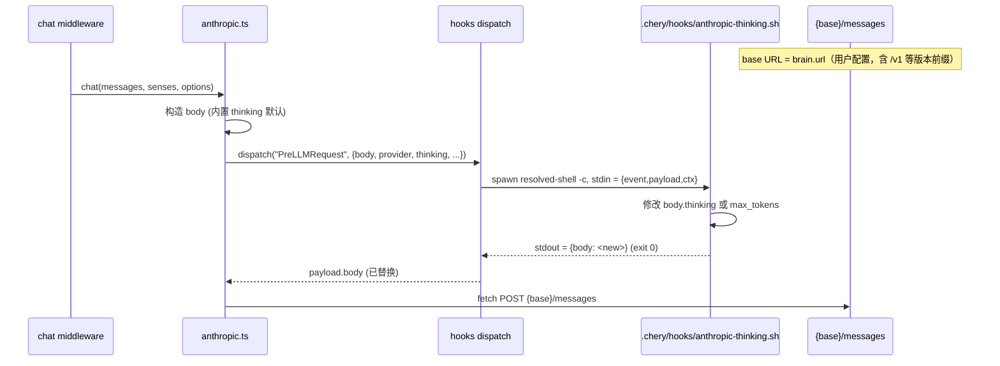

# Hooks（事件驱动扩展点）

> 源码 [src/agent/hooks/](../../src/agent/hooks/) ｜ 上级 [agent](./README.md) ｜ 相关 [provider.md](./provider.md)｜[interaction.md](../interaction.md)

## 职责

让用户在 `.chery/hooks/hooks.json` 声明「事件→handler」映射，由 dispatcher 在 LLM 调用/工具执行/会话生命周期等关键点触发 shell handler，读 stdin JSON、写 stdout JSON，框架据此改写请求/响应、阻断动作、注入上下文。是**仿 Claude Code hooks 风格的事件驱动扩展机制**，**不是** LLM 工具感官。

核心诉求：解决「anthropic 兼容端点 thinking 参数适配不完整」问题——通过 `PreLLMRequest` 事件在请求发送前改写 `body`（含 `thinking`/`max_tokens`/`tools` 等任意字段），覆盖任意怪异端点。

## 文件清单

| 文件 | 职责 |
|------|------|
| [types.ts](../../src/agent/hooks/types.ts) | 事件枚举 + 每个事件的 input/output/decision 类型 |
| [matcher.ts](../../src/agent/hooks/matcher.ts) | matcher（provider/exact/regex）+ `if` 谓词（jq-lite 子集） |
| [registry.ts](../../src/agent/hooks/registry.ts) | 加载 `.chery/hooks/hooks.json` + brain 级 hooks；schema 校验；mtime 重读 |
| [dispatch.ts](../../src/agent/hooks/dispatch.ts) | `dispatch(event, payload, ctx)` 主流程；spawn 解析后的 POSIX shell `-c`（见「跨平台执行」）；解析 stdout JSON；应用决策 |
| [index.ts](../../src/agent/hooks/index.ts) | barrel：聚合导出 |

## 事件清单

| 事件 | 触发点 | input | output / 决策 | 实现状态（本轮）|
|------|-------|-------|--------------|-----------------|
| `SessionStart` | chat 第一轮前 | `{chatId, brain}` | `{additionalContext?}` | stub |
| `SessionEnd` | chat 终止 | `{chatId, reason}` | `{}` | stub |
| `UserPromptSubmit` | 用户消息到、LLM 调用前 | `{chatId, prompt, role}` | `{decision?, reason?, additionalContext?}` | **完整**（chat.ts 接线）|
| **`PreLLMRequest`** | **provider 构造 body 后、fetch 前** | `{provider, model, url, thinking, stream, body}` | `{body?, decision?, reason?, metadata?}` | **完整**（anthropic provider 接线）|
| `PostLLMResponse` | LLM 响应解析后 | `{provider, model, content, thinking, senseCalls}` | `{content?, thinking?, senseCalls?, additionalContext?}` | **完整**（chat.ts 接线）|
| `PreToolUse` | tool middleware `doExecuteSense` 前 | `{name, args, chatId}` | `{decision?, updatedInput?, reason?}` | **完整**（tool.ts 接线）|
| `PostToolUse` | 感官执行成功后 | `{name, args, result, hash, chatId}` | `{decision?, reason?, additionalContext?}` | **完整**（tool.ts 接线）|
| `Stop` | LLM 返回 stop_reason=end_turn 后、yield 前 | `{chatId, message, stopReason}` | `{decision?, reason?, additionalContext?}` | **完整**（chat.ts 接线，decision:block 本轮仅 log）|
| `PreCompact` | context compaction 前 | `{chatId, tokenCount}` | `{decision?, reason?}` | stub |
| `PostCompact` | context compaction 后 | `{chatId, summary, tokenCount}` | `{}` | stub |

> stub = dispatcher 触发后 logger.event 记录事件，不调 handler；调用方代码已经预留。后续按用户反馈补齐（SessionStart/SessionEnd/PreCompact/PostCompact）。

## 核心概念

### 1. Handler 类型：`command`

**仅支持 shell 脚本 handler**（仿 Claude Code command hook，简化版）。handler 进程：
- **stdin**：框架写 `{event, payload, ctx}` JSON
- **stdout**：handler 写决策 JSON（任意字段缺失则视为未设）
- **退出码**：
  - `exit 0` + stdout JSON → 解析为决策
  - `exit 2` → 阻断式错误（PreLLMRequest/PreToolUse/PreCompact 阻断对应动作；stderr 喂回 LLM 或用户）
  - 其它非零 → 非阻断错误，记 `logger.event("hook.failed",...)`，**继续下一个 handler**

> 不支持 `prompt`/`agent`/`http`/`mcp_tool` handler 类型（Claude Code 支持但本轮不引入，保持简单）。

### 2. 配置：`.chery/hooks/hooks.json`

```jsonc
{
  "PreLLMRequest": [
    {
      "matcher": "anthropic",                    // 可选：按 provider 过滤（exact/regex）
      "if": "thinking == 'high'",                // 可选：jq-lite 谓词（基于 stdin payload+ctx）
      "command": "${CHERY_DIR}/.chery/hooks/anthropic-thinking.sh",
      "timeout": 10                              // 秒，默认 10
    }
  ],
  "PreToolUse": [
    {
      "matcher": "write_file|read_file",
      "command": "${CHERY_DIR}/.chery/hooks/guard.sh"
    }
  ]
}
```

**matcher 规则**（仿 Claude Code）：
- 字符串仅含字母数字/`_`/`-`/`,`/`|``/空格 → 精确字符串或 `|`/`,` 分隔的字符串集合
- 含其它字符 → JS 正则（unanchored）
- 省略或 `*` → 匹配全部

**`if` 谓词**：jq-lite 子集，仅支持 `{field} ==/!= "value"`、`{field}` truthy/falsy、`{field1} == {field2}`。基于 dispatcher 喂给 handler 的 `{event, payload, ctx}` 对象访问字段。

### 3. Brain 级覆盖

`BrainConfig.hooks?: string`（相对 `.chery/` 路径）指向一个 brain-specific `hooks.json`，事件 handler 与全局**合并**（全局在前、brain 级在后；brain 级决策覆盖全局）。

仿 mock 自读 config（`findMockFile` 先例）—— dispatcher 按 brain name 加载合并表，**不需经 LLMOptions**。

### 4. Dispatch 流程

```ts
async function dispatch<TIn, TOut>(
  event: HookEvent,
  payload: TIn,
  ctx: { brain: string },
): Promise<TOut | undefined>
```

1. registry 查 event → 合并全局 + brain 级 handler 列表
2. 按 matcher 过滤 → 按 `if` 谓词过滤
3. **顺序执行**（不支持并发：避免 stdout 竞态）handler：
   - spawn `<resolved> -c command`（经 `resolvePosixShell()` 解析，见「跨平台执行」），stdin 写 `{event, payload, ctx}` JSON；任何 spawn 控制台子进程都须带 `windowsHide: true` 防漏（约定见 [web/electron.md](../web/electron.md#electron-spawn-后端模式-2)）
   - 解析 stdout JSON（catch 单行解析失败，跳过该 handler）
   - 应用决策：
     - `{body}` → 替换 `payload.body`
     - `{decision:"block"}` → 抛 `ClassifiedError(category:"validation", userMessage:reason ?? "被钩子拦截")` 阻断
     - `{additionalContext}` → 注入 chat 上下文
     - exit 2 → 阻断（stderr 喂回上游）
4. 任一 handler 异常（非 0/2）：log `logger.event("hook.failed",...)`，**继续下一个**

### 5. 加载策略：mtime 重读

- `bootstrapAgentRuntime` 启动期读 `.chery/hooks/hooks.json` + 各 brain 级 hooks.json，校验 schema
- **handler 进程不预热**（仿 mock 哲学：每次 dispatch 按需 read+spawn→dev 改 hooks.json 免重启）
- `.chery/hooks/*.sh` 是脚本，按需 `cat`/`exec`；不是闭包，不需缓存

### 6. 跨平台执行（POSIX shell 解析）

hooks 的 command 是 **POSIX shell 语法**（`$VAR` 展开、管道、单引号、`.sh` 脚本 shebang），不能用 `cmd /c` 执行。dispatcher 统一经 `resolvePosixShell()`（[core/security/sandbox.ts](../../src/core/security/sandbox.ts)）解析执行器：

- **Linux / macOS**：直接 `sh`（历史行为不变）
- **Windows** 探测链（模块级缓存，仿 `resolveShellExecutable('powershell')` 的探测→降级→缓存先例）：
  1. PATH 上的 `bash`（`bash -c true` 探测）
  2. PATH 上的 `sh`
  3. `where git` 反查 git.exe 安装位置 → 推导 `<Git 安装目录>/usr/bin/bash.exe`（Git for Windows 标准布局）
  4. 常见安装路径直查（如 `C:\Program Files\Git\usr\bin\bash.exe`）
  5. 全部失败 → 抛 `HOOK_SHELL_UNAVAILABLE`（userMessage 附安装指引）

Git Bash 的 `bash` 完全兼容 `/bin/sh` 脚本与 POSIX 语法；`${CHERY_DIR}` 等模板展开由框架完成（`expandCommandTemplate`），与平台无关；handler 脚本自身的工具依赖（如 `jq`）由脚本保证，缺失时以 exit 非零落回非阻断语义。

**失败语义表**（区分「平台缺失」与「handler 业务失败」）：

| 情形 | 行为 | 依据 |
|------|------|------|
| shell 解析失败 / spawn ENOENT | **阻断**（fail-loud）：抛 ClassifiedError，userMessage 指路（装 Git Bash 或删该 handler） | 对安全类 handler 静默跳过 = fail-open，不可接受 |
| exit 0 + stdout JSON | 解析为决策 | 正常路径 |
| exit 2 | 阻断，stderr 作为 reason | handler 显式阻断 |
| exit 其他非零 | **非阻断**：log `hook.failed`，继续下一 handler | handler 业务失败 |
| timeout | kill + log `hook.timeout`，跳过该 handler | 超时防护 |

**启动期健康检查**：`loadHookRegistry()` 首次构建表后，若注册了任何 handler，立即探测 shell；失败打 `hooks.registry.shell_unavailable` warn（先例：git 导入的 `gitNotInstalled` 预探测）——平台缺失在**事故前**暴露，而非在会话中反复撞墙。

**设置页状态**：`hooks.get` 响应携带 `shellInfo { platform, available, executable?, hint? }`，HooksTab 页头展示当前解析结果。

**Windows 前提**：安装 Git for Windows（或任何把 bash.exe 放进 PATH 的环境，如 MSYS2）。

## 关键流程

### Thinking 适配（核心用例）



### matcher + if 谓词

```ts
// matcher.ts
type Matcher = string  // exact / 分隔集合 / 正则
function matches(matcher: Matcher | undefined, value: string): boolean

// 简化版 if 谓词（jq-lite）
// 支持：'field == "x"'、'field != "x"'、'field' (truthy)
// 不支持：算术/函数调用/复杂表达式
function evalIf(expr: string, ctx: Record<string, unknown>): boolean
```

## PreLLMRequest 详细契约

**input**（stdin JSON）：
```ts
{
  event: 'PreLLMRequest',
  payload: {
    provider: string         // 'anthropic' | 'openai' | ...
    model: string
    url: string              // base URL（含版本前缀如 /v1）
    thinking: 'off'|'on'|'low'|'medium'|'high'|undefined
    stream: boolean
    body: Record<string, unknown>  // provider 构造的完整请求体
  },
  ctx: {
    brain: string            // brain name
  }
}
```

**output**（stdout JSON）：
```ts
{
  body?: Record<string, unknown>   // 替换 body（最常用）
  decision?: 'block'|'allow'       // 'block' → 抛 ClassifiedError 阻断
  reason?: string                  // 阻断时的 user-facing 文案
  metadata?: Record<string, unknown>  // 附加元数据（不修改 body，仅记录到日志）
}
```

**示例 handler（`anthropic-thinking.sh`）**：
```bash
#!/bin/sh
# 读取 stdin JSON
INPUT=$(cat)

# jq 提取 thinking/model
THINKING=$(echo "$INPUT" | jq -r '.payload.thinking // "off"')
MODEL=$(echo "$INPUT" | jq -r '.payload.model')
BODY=$(echo "$INPUT" | jq -c '.payload.body')

# 不同模型/档位适配
case "$MODEL" in
  *sonnet*|*haiku*|*opus*)
    # 官方 API：body 不动
    echo "$INPUT" | jq '{body: .payload.body}'
    ;;
  *)
    # 聚合端点：thinking 改成 enabled+budget_tokens
    NEW_BODY=$(echo "$BODY" | jq --arg t "$THINKING" '
      . + {
        thinking: (
          if $t == "high" then { type: "enabled", budget_tokens: 8000 }
          elif $t == "medium" then { type: "enabled", budget_tokens: 4000 }
          elif $t == "low" then { type: "enabled", budget_tokens: 2000 }
          else { type: "disabled" }
          end
        )
      } | del(.output_config)
    ')
    echo "$INPUT" | jq --arg nb "$NEW_BODY" '{body: ($nb | fromjson)}'
    ;;
esac
```

## 依赖与关联

| 依赖 | 用途 |
|------|------|
| [src/utils/config.ts](../../src/utils/config.ts) | 读 `BrainConfig.hooks`（相对 `.chery/`） |
| [src/utils/error.ts](../../src/utils/error.ts) | `ClassifiedError` 抛阻断错误 |
| [src/utils/logger](../../src/utils/logger/) | `logger.event('hook.failed',...)` 落盘 |
| Node 内建 | `child_process.spawn`/`fs.readFileSync`/`path.join` |

### 被依赖

| 调用方 | 用途 |
|--------|------|
| [agent/middleware/chat.ts](../../src/agent/middleware/chat.ts) | UserPromptSubmit / PreLLMRequest / PostLLMResponse / Stop dispatch |
| [agent/middleware/tool.ts](../../src/agent/middleware/tool.ts) | PreToolUse / PostToolUse dispatch |
| [agent/middleware/checkpoint.ts](../../src/agent/middleware/checkpoint.ts) | PreCompact / PostCompact dispatch |
| [agent/bootstrap.ts](../../src/agent/bootstrap.ts) | 启动期 `loadHookRegistry()` |
| [agent/provider/anthropic.ts](../../src/agent/provider/anthropic.ts) | fetch 前自动 dispatch PreLLMRequest（thinking 适配） |

## 扩展点

### 加事件

1. 在 [types.ts](../../src/agent/hooks/types.ts) 加事件名到 `HookEvent` 联合 + 该事件的 `Payload`/`Decision` 类型
2. 在 [dispatch.ts](../../src/agent/hooks/dispatch.ts) `dispatch` 函数内加 `case "<Event>": logger.event(...)`（stub）或完整 handler 调用
3. 在调用方（chat/tool/checkpoint）加 `dispatch("<Event>", payload, ctx)`

### 改 matcher / if 谓词

仿 Claude Code matcher 规则改 [matcher.ts](../../src/agent/hooks/matcher.ts)。`if` 谓词当前 jq-lite 子集，扩展需在 `evalIf` 内加 token。

## 安全边界

- **信任边界**：`.chery/hooks/`（同 `.chery/senses/`、`installSkill` staging 隔离）——本地用户配置，与项目代码同级可信
- **任意 shell 无沙箱**：handler 进程以主进程用户权限执行，可调任意 global（process/fs/network）——文档明示，**不沙箱**
- **凭据泄露面**：handler 脚本不应包含 secrets（应从环境变量读，如 `${CHERY_DIR}` 注入）；dispatcher **不**把 `key/token` 喂给 handler
- **pathGuard 协同**：`.chery/hooks/` 受 pathGuard 保护（`GUARD_EXEMPT` 暂无 hooks 写入场景；如需工具通过 hooks 写 `.chery/hooks/`，需手工加豁免）
- **handler 失败不阻断**：单 handler 异常 → log + 继续下一个；exit 2 → 阻断（设计如此，区分异常与显式拒绝）

## 最小可用 vs 完整版（本轮范围）

本轮已实现 6 个核心事件完整路径 + 接线：
- **PreLLMRequest**：完整（anthropic provider 在 fetch 前 dispatch；body 替换 / block 阻断）
- **UserPromptSubmit**：完整（chat.ts 入口 dispatch；block 抛 ClassifiedError 终止 chat）
- **PostLLMResponse**：完整（chat.ts handleStream/handleNonStream 末尾 dispatch；审计）
- **PreToolUse**：完整（tool.ts doExecuteSense 前 dispatch；updatedInput 改 args / block 阻断）
- **PostToolUse**：完整（tool.ts doExecuteSense 后 dispatch；block 改 content 为 reason）
- **Stop**：完整（chat.ts 末尾 dispatch；decision:block 本轮仅 log，"强制继续"需 loop.ts 配合后续扩展）

仍 stub（4 个）：SessionStart / SessionEnd / PreCompact / PostCompact——dispatch 触发时 logger 后返回 undefined，调用方代码已预留，后续按需补 handler 调用。

Brain 级覆盖、matcher + if 谓词均已完整实现。